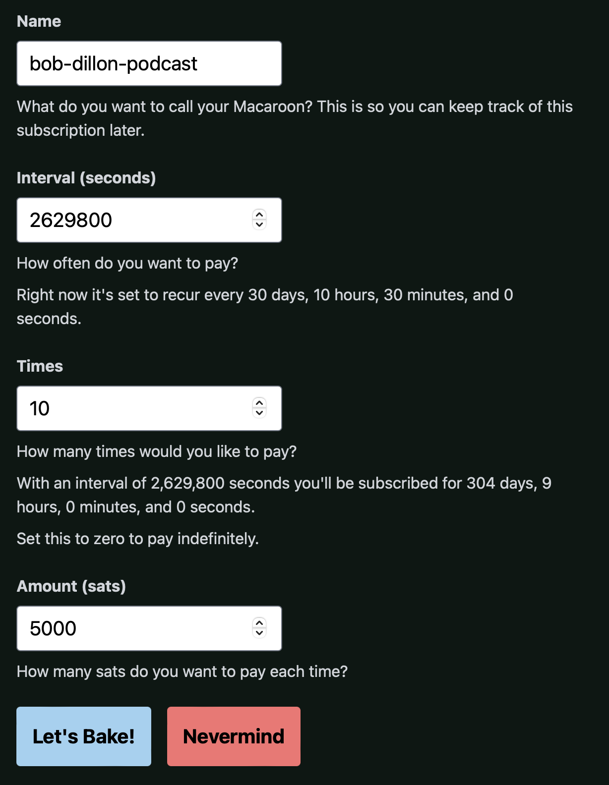

## bLIP 12: The inspiration

bLIP 12, also known as "Sat Slayer," was a one-day hackathon project built by the authors in late 2021. It turned into a concept of Lightning "pull payments" and node-to-node communication.

## Static invoices

One "holy grail" of Bitcoin usability is a static payment "address" without actual address reuse. On the base layer the challenge is getting a unique address to "push" to. On Lightning there's no concept of a payment address. A payment is usually an interactive process where the receiver generates a unique "invoice" which is then paid by the sender. Some will understand this as a BOLT11 invoice.

[_BOLT_ 12][bolt12] is a popular and only slightly controversial proposed spec for creating a static "offer." This offer encodes enough information for the sender to request an actual invoice from the receiver. This process uses the Lightning network itself to transmit this information.

By confining itself to the Lightning network, there's no need for an additional "server" on the part of the sender or receiver. Communication does not need to use scary old-world technologies like HTTPS, which is how the [LNURL][lnurl] protocol works. The downside to BOLT12 is that it relies on a new concept known as "onion messages." Onion messages are peer-to-peer, unpaid-for onion traffic. Nodes would use onion messages to achieve communication between each other for payments.

The joke of "bLIP 12" is to achieve BOLT 12's aims, but to do it ourselves without a major consensus-based spec.

(A ["bLIP"][blip] is a lightweight alternative to a "BOLT." bLIPs propose application-level standards to Lightning without changes to the underlying protocol.)

(bLIP 12 is not actually a bLIP, it's more of a comment on BOLTS and bLIPS than a serious contender in that space)

## Subscription payments

One of the standout ideas of BOLT 12 that [was eventually cut][recurrence] is the idea of subscription payments -- also known as "recurrence." This is another of those "holy grails" of Bitcoin usability.

BOLT 12 only described a way for an offer to encode the idea of recurrence. Node implementations will want to create a way for users to authorize a recurring payment once (within parameters defined in the offer). Afterward they will continue making those payments without ongoing interaction from the user. "Set it and forget it," so to speak.

## How bLIP 12 works

How can we get static invoices and subscription payments without a BOLT?

It turns out the static invoice part is pretty easy: LND already has a feature called [AMP invoices][amp]. There's no BOLT for AMP yet, so it's not a standard across node implementations, but it gets us a static invoice without any of the fancy new protocol requirements of BOLT 12:

> Using AMP, it is possible to make payments safely by only knowing the public key of the recipient. It is also possible to create invoices that can be used repeatedly, which can be used to implement traditional subscriptions. Such invoices can also be published without security implications, allowing for use cases such as static donation invoices.

Well, that was easy!

But our idea for subscription or "pull" payments is a lot more involved. At a high level, here's how it works. 

The sender pays an AMP invoice and includes connection and authorization information in the TLV of the payment. That will allow the _receiver_ to connect directly to the sender node. Now, as long as the receiver stays within the parameters encoded by the sender, they can trigger payments to themselves.


Unfortunately, due to the time constraints of the hackathon, we only were able to implement the static AMP invoice part.

You can see our presentation here: [Sat Slayer - Pull Payments w/Reusable Invoices][satslayerdemo]

## Bake Shop

It turns out there are two hard bits to bLIP 12:

1. The generation of rules for the sender to give to the receiver (the payment puller)
2. The enforcement of those rules

In LND those bits can be achieved with a special "macaroon" that encodes the permissions and a "GRPC interceptor" that enforces them.

- A macaroon is a decentralized authentication token that is required when accessing an LND node.
- A GRPC interceptor is middleware that API requests are sent to outsource authentication.

We decided a good follow-up to the Sat Slayer hackathon project would be a "Bake Shop" application to handle these two macaroon-related jobs.

## How Bake Shop works

Bake Shop has three main parts:

1. A frontend UI where the user can input their desired macaroon restrictions like 
  a. Amount
  b. Recurrence interval
  c. Number of times the payment will recur
2. A backend that
   a. Bakes the macaroon with these custom caveats
   b. Is a long-running process that acts as a GRPC interceptor for LND
3. A simple "payment puller" demo script that can connect to the payer node and pull payments 

Unlike the feature-incomplete hackathon project, these are all things that we have working code for. It can be found in the [Bake Shop Github repo][bakeshopgithub] with the obvious caveat that this would be an extremely reckless thing to use. The reason why it would be reckless is that the GRPC interception needs to be hardened, tested, and secured. Any potential bug that did not correctly disallow bad payment requests could lead to stolen funds. Examples of this include bugs such as database errors or time conversion problems.

## A Bake Shop example

Alice wants to pay Bob Dillon 5,000 sats a month for access to his podcast. She loads up Bake Shop which is running on the same machine that hosts her LND node.

She names the macaroon so she can be reminded what it's for in the future. She picks an interval of `2629800` seconds (roughly a month). She specifies 10 for the number of times (she can cancel at any time, but these 10 payments will go through automatically). Lastly, she specifies the amount.



This results in a macaroon and the [`lndconnect` URL][lndconnect] for her node. She gives these two things to Bob so that he can pull payments going forward.

Here's an example hex-encoded macaroon with the encumbrances we described:

```
0201036c6e64022f030a10221a23812cf1cb32b94f9734e506eb6a1201301a170a086f6666636861696e120472656164120577726974650002376c6e642d637573746f6d20737562736372696265206d733a3236323938303030303020616d6f756e743a353030302074696d65733a3130000006205657dc7389e52f2cc628bf076893be76eab3718ffcc09e9967563aff45c6679c
```

Decoded to JSON, the macaroon looks like this:

```json
{
  "v": 2,
  "s64": "Vlfcc4nlLyzGKL8HaJO-duqzcY_8wJ6ZZ1Y6_0XGZ5w",
  "i64": "AwoQIhojgSzxyzK5T5c05QbrahIBMBoXCghvZmZjaGFpbhIEcmVhZBIFd3JpdGU",
  "l": "lnd",
  "c": [
    {
      "i": "lnd-custom subscribe ms:2629800000 amount:5000 times:10"
    }
  ],
  "identifier_decoded": {
    "nonce": "221a23812cf1cb32b94f9734e506eb6a",
    "storageId": "30",
    "ops": [
      {
        "entity": "offchain",
        "actions": [
          "read",
          "write"
        ]
      }
    ]
  }
}
```

A few important fields are present in this macaroon that are different from the ordinary ones that LND creates by default. Commonly known as the admin/invoice macaroons. 

```json
  "c": [
    {
      "i": "lnd-custom subscribe ms:2629800000 amount:5000 times:10"
    }
  ]
```

This specifies caveats on the macaroon. A caveat is a special condition that limits the functionality the macaroon may have.

- `lnd-custom` tells LND that it is a custom caveat that is not handled by LND itself. LND needs this at the beginning of the caveat so that it knows a interceptor might be set up to utilize it. 
- `subscribe` tells LND the type of custom caveat that a user might have set up. LND GRPC interceptors must register the type of caveat that they are going to handle. Only requests with the type `subscribe` will be forwarded to our interceptor in the Bakeshop. 
- `ms:2629800000`  tells our interceptor that the macaroon is valid once every `2629800000` milliseconds. 
- `amount:5000` tells our interceptor that the amount that can be pulled with this macaroon is `5000` sats per valid request. In combination with a `ms` caveat, this means 5000 sats per `2629800000` ms. 
- `times:10` tells our interceptor that the maximum amount of times that a valid request may go through is 10. 


It is the presence of the caveat that triggers Alice's interceptor to run when Bob connects to her node using this macaroon. Here the interceptor will check that Bob is only trying to pull 5000 sats, that he hasn't been paid in the past 2629800000 milliseconds, and that he has not pulled a valid payment more than 10 times. 

Another important field that's a bit different than a normal macaroon is: 

```json
    "ops": [
      {
        "entity": "offchain",
        "actions": [
          "read",
          "write"
        ]
      }
    ]
```

This specifies certain operations that the macaroon holder can partake in with LND. The `offchain` entity specifies that the offchain APIs are available to use. Even if the interceptor did not validate correctly, API calls that use `onchain` operations are forbidden. 

`read` and `write` are also important. API calls like `SendPayment` need `write` permissions in LND since they require a write action -- in this case, sending a payment.

In the end, this macaroon is all that is required to "log into" a specific LND node directly. There does not need to be any knowledge of who the person is. These macaroons should be treated as authentication tokens and only given out to those authorized to make a payment. Any custom logic can be implemented; it is up to the authors of GRPC Interceptors to handle custom logic.

## Additional features

Beyond the special caveats and use cases specified above, some extra features could be implemented as well.

### Fiat oracles

If a subscriber and/or receiver wishes to receive a fiat denominated amount, they could agree upon one or multiple oracles. These oracles would provide the real-time fiat price of bitcoin. A custom caveat such as `amount:5USD` and `oracle:kraken.com,gemini.com` could be specified to enforce this. There are risks associated with relying on oracles, which is why multiple are suggested.

### Associating user IDs

The bakeshop example specified above works best in a donation-based model. Especially when one subscriber wants to donate recurring payments without extra thought. There are other use cases such as a Netflix-style subscription approach. Applications may want to attribute payment to a user account so that the user can keep their subscription active. This looks very similar to what we have today with card payments. The trade-off to that is if a user does not utilize the service for the month, the payment was not necessary. This is why we believe the bakeshop works best for donations. Push payments/paywalls can continue to work well when paying monthly for a service. BOLT11 invoices service these well.

## Bake Shop / bLIP 12 limitations

There are a bunch of limitations to the Bake Shop setup and the whole bLIP 12 idea in general. Let's just go through a few of them:

### 1. Usability for the receiver

The receiver is required to securely store critical information for every payer and to use it repeatedly. While BOLT 12 is trying to reduce the necessity of extra servers, _bLIP 12_ needs them to run an automated process to pull payments. One possibility is to have third party payment pullers direct the funds to the intended recipient. However, there are security and privacy trade-offs that we specify below.

### 2. Usability for the payer

#### Incorrect info / disputes

In the traditional pull payment fiat world, you enter your credit card information and click "subscribe." You don't have to enter all the details of the intervals, amounts, and duration on your local credit card "node."

bLIP 12 could potentially embed these in the AMP invoice from Bob, but there's the concern that he could trick Alice into paying more than she planned. (Also a problem with credit cards, but they have a dispute process that is not present in Bitcoin / Lightning). Since Alice is the one creating the custom macaroon on her node, it is up to her to ensure the correct caveats are used. Alice can revoke them at any time, but any funds that are withdrawn before the revocation can not be taken back.

#### Always online

Due to the complexities involved in enforcing custom macaroons, the subscriber needs to be online and run the Bake Shop on a server. Since the Lightning node itself needs to be online so that payment pullers can access it, the Bake Shop can live on the same node. Installing Bake Shop can be made easy with node in a box solutions such as umbrel or raspiblitz. Unfortunately, it would not be advisable to offload GRPC interceptors to a third party. Giving a third-party access would be trusting them with their funds. The third-party could request funds and approve them in the interceptor.


### 3. Security

In the current setup, there's no association between a baked macaroon and a specific payee. If Bob handed the `lndconnect` info to Carol (or was hacked), Alice would have no way of knowing she's paying the wrong recipient.

One potential solution is to embed a destination pubkey in the macaroon's caveats. Alice's GRPC interceptor could validate that the payment is going to that pubkey. This would allow third party Bakeshop payment pullers to exist. Any person with the macaroon can pull the payment as long as they obey the conditions set in the macaroon caveats. If a payment address was also listed in the caveats, a hacker could not send the funds to their node. The worst they could do is fulfill the payment to the destined receiver, which just helps carry out the intended effect.

This could lead to a website where payment pullers enter the `lndconnect` info they have received from a subscriber. The third-party bakeshop server is the one pulling the payments. That way no server for payment pullers is needed. 

### 4. Privacy

One privacy trade-off to the Bake Shop is the fact that the payment puller knows what node the payment is coming from. With a typical Lightning Network payment, onion routing hides the sender node. In our case, payment pullers know the connection info of the payer. 

If a third-party Bake Shop were pulling the payments on behalf of the recipient, then they know the connection info and the intended destination as well. If the sender was subscribed to multiple people, this type of aggregative insight is not good.  

## The cron job elephant in the room

Everything Bake Shop achieves via elaborate macaroon-baking and promiscuous `lndconnect` sharing could be accomplished much more simply, securely, and privately. Alice could just run a cron job on her node to make recurring payments. In place of a long-running process to validate pull payments, the same process could trigger payments to Bob's static AMP invoice.

There could be other applications that benefit from an easy-to-use macaroon bakery and interceptor. However, it seems that subscription payments, at least in our formulation, are not one of them.

## Next steps

We hope you don't feel as if we've wasted your time (or ours) by exploring an idea that is inferior to running a payment scheduler on a node.

The authors believe that:

1. Easy-to-use subscription payments would be a big usability and adoption win for Lightning.
2. You don't want to "pull payments" when you have payment finality.

So hopefully these bLIP 12 / Bake Shop experiments help shade in some of the nuances in-between those two statements.

One potential next step for us is to build a Cron Shop app that will give users an easy way to make recurring payments.

Since BOLT 12 has punted on the idea of recurrence, now is a good time to experiment with ways of handling subscriptions at the application layer without relying on protocol rules. LND already has the concept of static invoices, we can create push payment style recurring payments today.

## Final thoughts

This project was a fun way to explore the specifics of macaroon caveats and GRPC interceptors. One of the core ideas behind this is that node-to-node communication does not have to be routed over the Lightning network for subscriptions. In the end, pull payments may not be the approach to take. Instead, optional recurring push payments to a static AMP invoice would be an easier method.


[bolt12]: https://bolt12.org
[blip]: https://github.com/lightning/blips
[lnurl]: https://github.com/fiatjaf/lnurl-rfc
[recurrence]: https://github.com/lightning/bolts/pull/798/commits/2b923a0367c5f9154fcec706e3302cc4658dd889
[amp]: https://docs.lightning.engineering/lightning-network-tools/lnd/amp
[satslayerdemo]: https://www.youtube.com/watch?v=c8tEebKEN4Y
[bakeshopgithub]: https://github.com/futurepaul/bakeshop
[lndconnect]: https://github.com/LN-Zap/lndconnect
